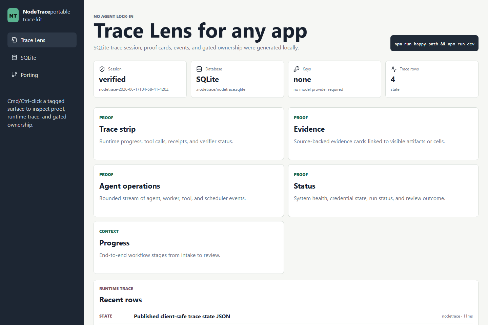
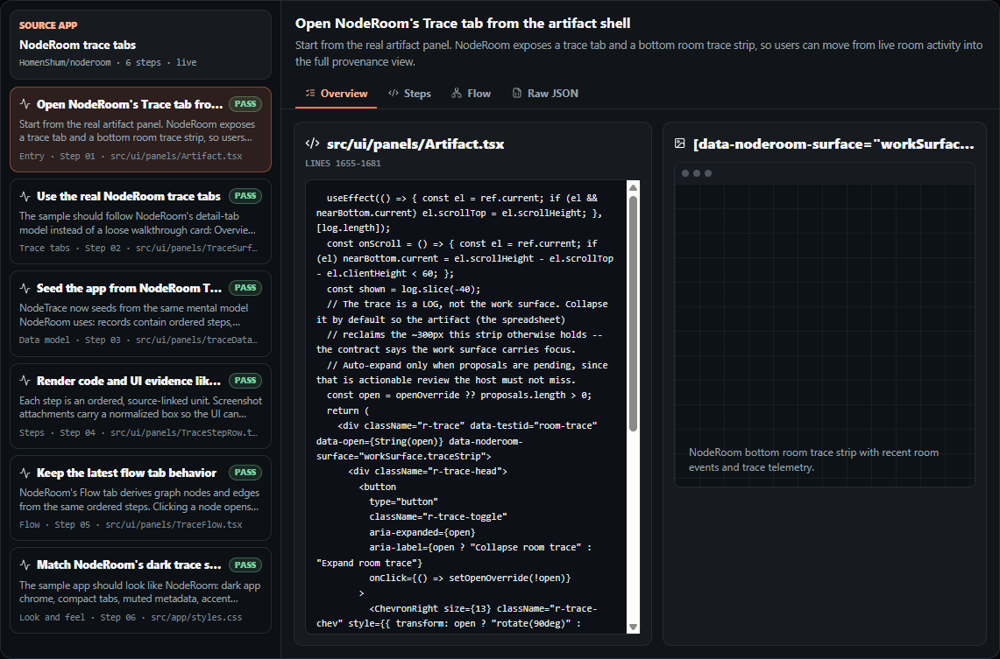
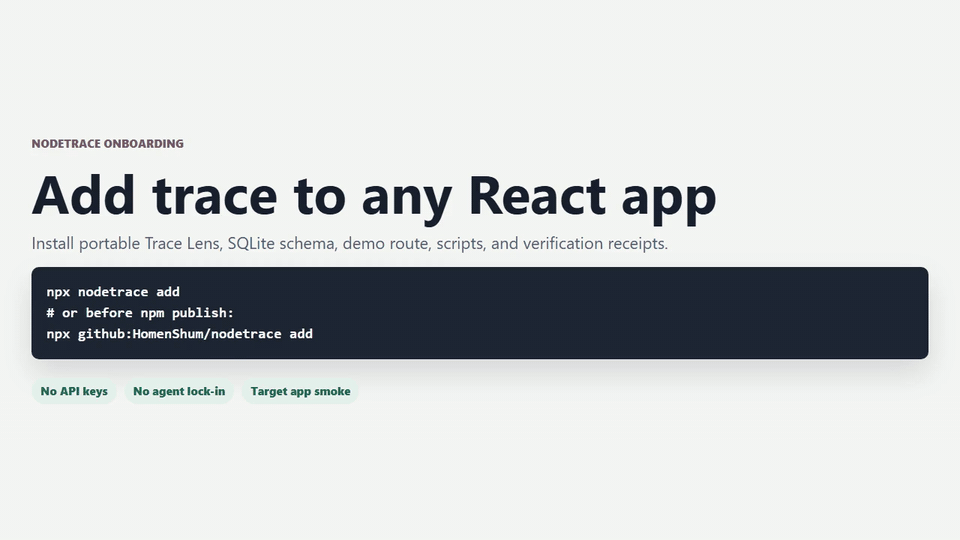
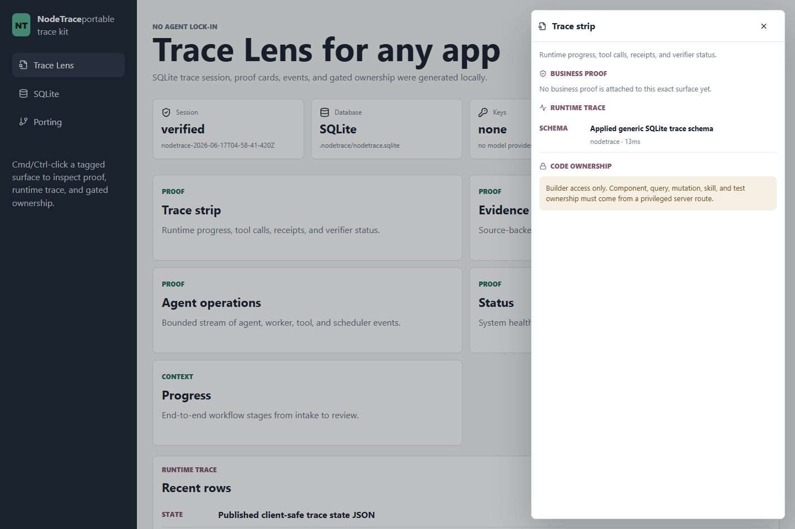

# NodeTrace

Portable Trace Lens UI and SQLite setup for agent-native apps.

NodeTrace gives any coding agent a ready-to-port trace layer: tagged UI
surfaces, a Review/Builder Trace Lens, business proof cards, bounded runtime
trace rows, gated code ownership, and a local SQLite happy path. It is not bound
to NodeAgent's agent architecture. Bring your own agent, tools, queue, database,
or model provider.

Agent-trace injection guide: [`docs/AGENT_TRACE_ADOPTION.md`](docs/AGENT_TRACE_ADOPTION.md).

[Visual walkthrough](docs/WALKTHROUGH.md) · [Porting guide](docs/PORTING.md)

## Happy Path

```bash
npm install
npm run happy-path
npm run dev
npm run smoke
```

The default path uses no API keys and no cloud account. `npm run happy-path`
creates:

- `.nodetrace/nodetrace.sqlite`
- `public/nodetrace-state.json`
- `docs/eval/nodetrace-happy-path.json`

Open the Vite URL and Cmd/Ctrl-click any tagged surface to open Trace Lens.



## Add To An Existing App

From a React/Vite app:

```bash
npx github:HomenShum/nodetrace add --framework vite
```

From a Next.js App Router app:

```bash
npx github:HomenShum/nodetrace add --framework next
```

The unscoped `nodetrace` npm name is already occupied by an unrelated package.
When this repo is published to npm, use the scoped package:

```bash
npx @homenshum/nodetrace add
```

The repo includes a no-skip Next proof for coding agents:

```bash
npm run installer:next:e2e
```

That command creates a throwaway Next App Router target, installs dependencies,
runs the NodeTrace happy path and target smoke, then runs the target's real
`next build`. It also verifies Windows BOM-prefixed `package.json` files.

For long-running QA/browser/workflow agents:

```bash
npm run agent:scale:smoke
```

That proof creates a 125-step QA-agent trace fixture, verifies the public client
state remains Builder-safe, and confirms the Trace Lens keeps a bounded runtime
window for the clicked surface. The integration prompt is in
[`examples/qa-agent/README.md`](examples/qa-agent/README.md).

For a NodeRoom codebase Trace Coach walkthrough:

```bash
npm run trace-coach:sqlite
npm run dev
```

That proof seeds the local sample app from NodeRoom's real trace-tab source
path. It writes a SQLite-backed campaign where each ordered step contains a
step label, real NodeRoom file path and line range, UI selector, DOMRect
bounding box, screenshot path, and Mermaid flow source. See
[`examples/trace-coach-sqlite/README.md`](examples/trace-coach-sqlite/README.md).



Default `add` behavior:

- copies `src/nodetrace/`
- creates `src/nodetrace-demo/`
- creates `nodetrace.html` for Vite or `/nodetrace` App Router page for Next
- copies the SQLite schema and init/smoke scripts
- patches `package.json` scripts and missing dependencies
- runs install, no-key happy path, target smoke, and build when available
- writes `.nodetrace/setup-receipt.json`

Then run:

```bash
npm run nodetrace:dev
```

Open `/nodetrace.html` for Vite or `/nodetrace` for Next. No API keys are
required.

## Visual Walkthrough

The full screenshot walkthrough is in [`docs/WALKTHROUGH.md`](docs/WALKTHROUGH.md).



MP4 version: [`docs/walkthroughs/nodetrace-walkthrough.mp4`](docs/walkthroughs/nodetrace-walkthrough.mp4)

The walkthrough shows onboarding, the installer process, the finished no-key
demo dashboard, and the Trace Lens overlay.

Cmd/Ctrl-click any tagged surface to open Trace Lens:



## What You Get

- `src/trace/TraceLensProvider.tsx`: global Cmd/Ctrl-click resolver.
- `src/trace/TraceLensPanel.tsx`: Review/Builder panel with the three trace regions.
- `src/trace/types.ts`: portable state contract.
- `src/trace/surfaces.ts`: client-safe opaque surface registry helpers.
- `db/schema.sql`: SQLite schema for sessions, surfaces, proofs, events, and gated ownership.
- `scripts/init-sqlite.mjs`: local database/state initializer.
- `examples/builder-access/server-route.mjs`: token-gated code ownership route.
- `examples/qa-agent/README.md`: coding-agent prompt for 100+ step QA traces.
- `examples/trace-coach-sqlite/README.md`: NodeRoom codebase Trace Coach example.
- `docs/AGENT_TRACE_ADOPTION.md`: injection checklist for external agent apps.
- `docs/PORTING.md`: copy/adapt checklist for coding agents.

## Trace Contract

NodeTrace follows the same safety shape as the NodeRoom Trace Lens:

- The client only sees opaque surface ids and user-facing labels.
- `Review` is the default mode.
- `Builder` tabs and code ownership only appear when `builderCapable` is server verified.
- `Business proof` shows source/evidence cards and confidence.
- `Runtime trace` shows bounded frame/tool/run events.
- `Code ownership` stays locked until a privileged server route supplies it.

Use either attribute on clickable surfaces:

```tsx
<section data-nodetrace-surface="workSurface.traceStrip">
  ...
</section>

// NodeRoom compatibility:
<section data-noderoom-surface="workSurface.traceStrip">
  ...
</section>
```

## Port Into Another App

1. Run `npx github:HomenShum/nodetrace add --framework vite` or `--framework next`.
2. Open `/nodetrace.html` for Vite or `/nodetrace` for Next and confirm the no-key demo works.
3. Tag your visible surfaces with `data-nodetrace-surface`.
4. Insert trace rows and proof cards from your app runtime.
5. Serve `NodeTraceState` to the client from your backend.
6. Keep code ownership behind a privileged server route with component, query, mutation, skill, and test ownership.

NodeTrace provides the setup needed for the UI and database path. It does not
choose your agent loop, model, tool runtime, queue, auth, or cloud provider.
