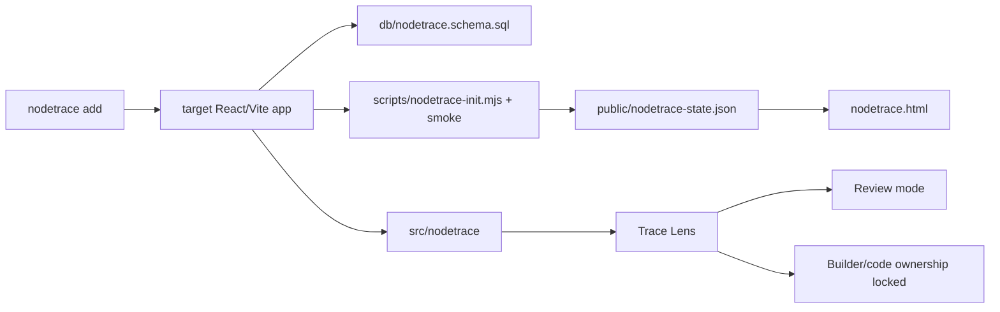

# NodeTrace Visual Walkthrough

NodeTrace is a portable trace layer for agent-native apps. This walkthrough
shows both the standalone demo and the expected target-app install flow.

## MP4/GIF Walkthrough


MP4 version: [nodetrace-walkthrough.mp4](walkthroughs/nodetrace-walkthrough.mp4)

The clip covers onboarding, the target-app installer process, the finished
local dashboard, and the Trace Lens overlay.

## 1. Run The Standalone Happy Path

```bash
npm install
npm run happy-path
npm run dev
```

No API key or cloud account is required. The happy path writes:

```text
.nodetrace/nodetrace.sqlite
public/nodetrace-state.json
docs/eval/nodetrace-happy-path.json
```


What to verify:

- Session is `verified`.
- Database is `SQLite`.
- Keys are `none`.
- Trace rows are present.
- Surfaces are tagged and inspectable.

## 2. Open Trace Lens

Cmd/Ctrl-click a tagged surface, such as `Evidence`.


Trace Lens should show:

- `Review` and `Builder` modes.
- `Business proof` evidence cards.
- `Runtime trace` rows.
- `Code ownership` locked until a privileged route supplies ownership.

## 3. Add NodeTrace To Another App

From a React/Vite app:

```bash
npx nodetrace add
```

Before npm publication:

```bash
npx github:HomenShum/nodetrace add
```

The installer copies the trace UI, schema, demo entry, init/smoke scripts, and
patches `package.json`. It then runs install, happy path, target smoke, and
build when the target app has a build script. The receipt is:

```text
.nodetrace/setup-receipt.json
```

## 4. Architecture



## 5. Coding-Agent Integration Prompt

```text
Run npx nodetrace add in this app.
Keep the no-key happy path green before adding model/provider credentials.
Open /nodetrace.html and verify Trace Lens.
Tag product surfaces with data-nodetrace-surface.
Write app runtime events into sessions, surfaces, proofs, trace events, and gated ownership.
Keep builderCapable server-verified.
Run npm run nodetrace:happy-path, npm run nodetrace:smoke, and npm run build.
```

## 6. Done Criteria

- `.nodetrace/setup-receipt.json` has `"ok": true` after install.
- `npm run nodetrace:happy-path` passes in the target app.
- `npm run nodetrace:smoke` passes in the target app.
- Target build passes.
- `/nodetrace.html` renders a dashboard.
- Cmd/Ctrl-click opens Trace Lens.
- Code ownership is not exposed unless `builderCapable` is server verified.
