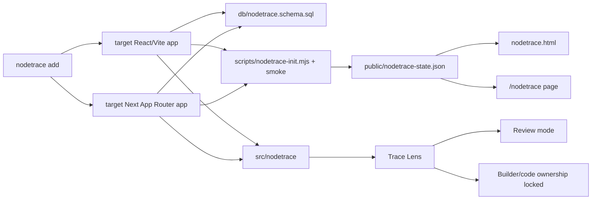

# NodeTrace Visual Walkthrough

NodeTrace is a portable trace layer for agent-native apps. This walkthrough
shows both the standalone demo and the expected target-app install flow.

## MP4/GIF Walkthrough


MP4 version: [nodetrace-walkthrough.mp4](walkthroughs/nodetrace-walkthrough.mp4)

The clip covers onboarding, the target-app installer process, the finished
local dashboard, and the Trace Lens overlay.

## 1. Run The Standalone Happy Path

```bash
npm install
npm run happy-path
npm run dev
```

No API key or cloud account is required. The happy path writes:

```text
.nodetrace/nodetrace.sqlite
public/nodetrace-state.json
docs/eval/nodetrace-happy-path.json
```


What to verify:

- Session is `verified`.
- Database is `SQLite`.
- Keys are `none`.
- Trace rows are present.
- Surfaces are tagged and inspectable.

## 2. Open Trace Lens

Cmd/Ctrl-click a tagged surface, such as `Evidence`.


Trace Lens should show:

- `Review` and `Builder` modes.
- `Business proof` evidence cards.
- `Runtime trace` rows.
- `Code ownership` locked until a privileged route supplies ownership.

## 3. Add NodeTrace To Another App

From a React/Vite app:

```bash
npx github:HomenShum/nodetrace add --framework vite
npx github:HomenShum/nodetrace add --framework next
```

After scoped npm publication:

```bash
npx @homenshum/nodetrace add
```

For a no-skip Next proof:

```bash
npm run installer:next:e2e
npm run agent:scale:smoke
npm run understand:noderoom
npm run capture:noderoom:real
npm run trace-coach:sqlite
```

The installer copies the trace UI, schema, demo entry, init/smoke scripts, and
patches `package.json`. It then runs install, happy path, target smoke, and
build when the target app has a build script. The receipt is:

```text
.nodetrace/setup-receipt.json
```

`npm run capture:noderoom:real` starts the latest local NodeRoom app, captures
actual VS Code source slices, measures live `data-noderoom-surface` DOMRects,
and stores actual running-app screenshots plus
`public/captures/noderoom-real-capture-manifest.json`.
`npm run trace-coach:sqlite` switches the demo state to a NodeRoom codebase
Trace Coach campaign based on that manifest, NodeRoom trace-tab files,
selectors, DOMRects, the Understand-Anything-backed minimap graph from
`npm run understand:noderoom`, and Mermaid source. It uses ordered step labels
instead of video timecodes.

## 4. Architecture



## 5. Coding-Agent Integration Prompt

```text
Run npx github:HomenShum/nodetrace add --framework vite or --framework next in this app.
Keep the no-key happy path green before adding model/provider credentials.
Open /nodetrace.html for Vite or /nodetrace for Next and verify Trace Lens.
Tag product surfaces with data-nodetrace-surface.
Write app runtime events into sessions, surfaces, proofs, trace events, and gated ownership.
Keep builderCapable server-verified.
Run npm run nodetrace:happy-path, npm run nodetrace:smoke, and npm run build.
Run npm run installer:next:e2e in the NodeTrace repo when changing the Next scaffold.
Run npm run agent:scale:smoke when changing trace-row rendering, Builder gating, or long-running agent state.
Run npm run understand:noderoom, npm run capture:noderoom:real, then npm run trace-coach:sqlite when changing the NodeRoom-style Trace Coach tabs, source/UI captures, or minimap graph.
Confirm docs/eval/nodetrace-understand-anything-noderoom.json says ok true and public/captures/noderoom-trace-knowledge-graph.json is Understand-Anything-backed.
Confirm public/captures/noderoom-real-capture-manifest.json points to actual VS Code and running NodeRoom PNG captures, not generated stand-ins.
Use examples/builder-access/server-route.mjs for a token-gated Builder ownership route.
```

## 6. Done Criteria

- `.nodetrace/setup-receipt.json` has `"ok": true` after install.
- `npm run nodetrace:happy-path` passes in the target app.
- `npm run nodetrace:smoke` passes in the target app.
- Target build passes.
- `/nodetrace.html` or `/nodetrace` renders a dashboard.
- Cmd/Ctrl-click opens Trace Lens.
- Code ownership is not exposed unless `builderCapable` is server verified.
