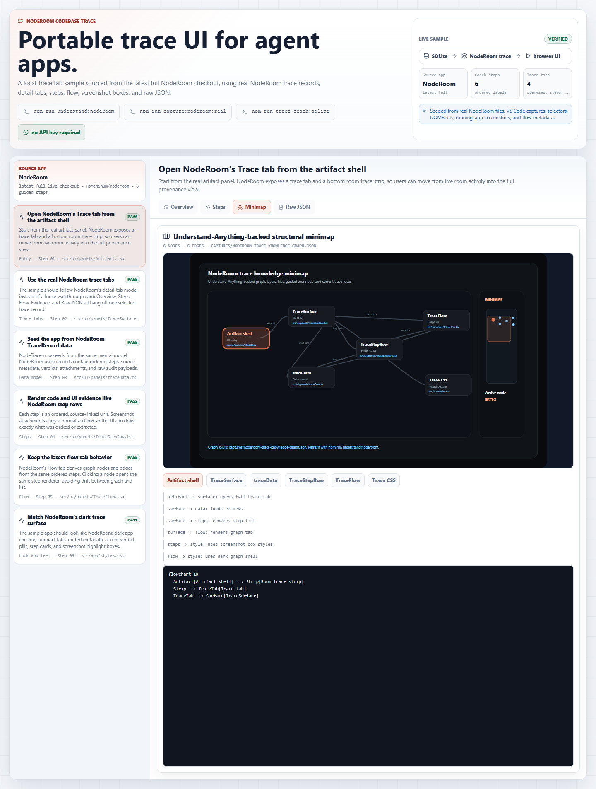

# Trace Coach SQLite Example

This example seeds the NodeTrace sample app with a NodeRoom codebase trace. It
does not use fake e-commerce files, and it does not bind the walkthrough to
video timecodes. The first pass is an ordered, coding-agent-friendly onboarding
path through NodeRoom's trace tab implementation.

The script prefers a live NodeRoom checkout at `../` from this repo. Override it
when needed:

```bash
NODETRACE_SOURCE_ROOT=/path/to/noderoom npm run trace-coach:sqlite
```

If a live checkout is not present, the script falls back to packaged NodeRoom
source snapshots so the demo remains runnable from a standalone NodeTrace clone.

The seeded steps point at the NodeRoom trace surface:

- `src/ui/panels/Artifact.tsx`
- `src/ui/panels/TraceSurface.tsx`
- `src/ui/panels/traceData.ts`
- `src/ui/panels/TraceStepRow.tsx`
- `src/ui/panels/TraceFlow.tsx`
- `src/app/styles.css`

Run:

```bash
npm run understand:noderoom
npm run capture:noderoom:real
npm run trace-coach:sqlite
npm run dev
```

`npm run understand:noderoom` looks for an installed Understand-Anything plugin
at `~/.understand-anything/repo/understand-anything-plugin`. If it is missing,
the script clones the upstream open-source repo into the ignored local cache
`.nodetrace/understand-anything/`, prepares its package, and runs its
deterministic scanner, import-map extractor, and structure extractor against
the NodeRoom trace files. Override discovery when needed:

```bash
UNDERSTAND_ANYTHING_PLUGIN_ROOT=/path/to/understand-anything-plugin npm run understand:noderoom
```

The script writes:

- `.nodetrace/trace-coach.sqlite`
- `public/nodetrace-state.json`
- `public/captures/*-ide.png`
- `public/captures/*-ui.png`
- `public/captures/*-minimap.svg`
- `public/captures/noderoom-real-capture-manifest.json`
- `public/captures/noderoom-trace-knowledge-graph.json`
- `docs/eval/nodetrace-understand-anything-noderoom.json`
- `docs/eval/nodetrace-trace-coach-sqlite.json`

The demo dashboard then renders a NodeRoom-style Trace Coach surface with:

- a left trace-record list
- detail tabs for Overview, Steps, Minimap, and Raw JSON
- ordered step labels, not video timestamps
- real NodeRoom code slices
- actual VS Code screenshots with the accurate folder path and highlighted code section
- actual running NodeRoom screenshots with `data-noderoom-*` selectors, DOMRect, screenshot path, and bounding box
- Mermaid flow source for the active step
- an Understand-Anything-backed minimap from `noderoom-trace-knowledge-graph.json`

## Visual Proof

After running the command, the local demo should look like this NodeRoom-style
trace surface:


The minimap tab should show a codebase graph focused on the active trace node:



## Why This Shape

The capture model is structural:

```text
NodeRoom source path + line range
actual VS Code screenshot
NodeRoom UI selector + DOMRect
actual running NodeRoom screenshot
Understand-Anything graph JSON and minimap screenshot
Mermaid source for the active minimap tab
```

That means a coding agent can adapt the example to another repo by changing
anchors and selectors, then running real IDE and app capture before seeding
SQLite. The trace UI does not need video timestamps to display the guided
codebase trace.

## Coding-Agent Prompt

```text
Create a NodeTrace Trace Coach walkthrough for this repo. Base every step on
real files in the codebase, not invented examples. Follow the NodeRoom trace-tab
shape: record list, Overview, Steps, Minimap, and Raw JSON. Use ordered step labels,
not video timestamps. For each step, provide codeBlock.filePath, startLine,
endLine, snippet, uiCapture.selector, uiCapture.rect, uiCapture.screenshotPath,
sourceView.imagePath, mapCapture.imagePath, mapCapture.graphPath, and
diagram.source. Capture visual assets from real VS Code and the running app;
do not publish generated IDE or UI stand-ins. Keep the first pass local and
SQLite-backed. Run npm run understand:noderoom, npm run capture:noderoom:real,
npm run trace-coach:sqlite, npm run smoke, and npm run build.
```

## Adapting To Another Codebase

1. Pick the core linear onboarding path first: entry surface, data model, step
   renderer, flow/graph renderer, styling, and raw audit payload.
2. Add stable `data-*` selectors to target UI regions.
3. Use an AST/LSP/coding-agent reader to resolve source file ranges.
4. Use Playwright to compute `getBoundingClientRect()` and capture screenshots.
5. Store those values in SQLite and publish `NodeTraceState.coach`.
6. Keep free graph exploration behind the linear walkthrough so beginners are
   not dropped into a large graph first.
